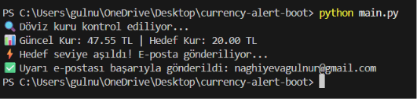
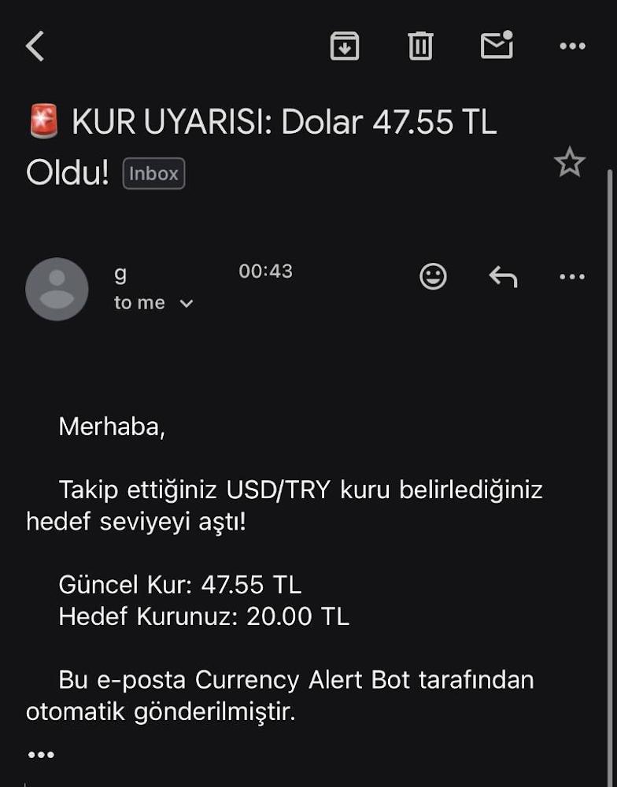

# 💵 Currency Alert Bot - Automated Exchange Rate Monitor

An automated Python tool that monitors live USD/TRY exchange rates in real-time and dispatches instant email alerts via SMTP whenever a pre-configured target rate threshold is exceeded.

## 📸 Preview

### Terminal Output


### Email Alert


##  Key Features

* **Real-Time Exchange Data:** Fetches live currency rates using a lightweight REST API integration.
* **Automated Email Notifications:** Sends formatted HTML/text email alerts using Python's native `smtplib` and MIME modules.
* **Secure Environment Management:** Sensitive API keys and credentials are completely isolated via `.env` environment variables.

##  Tech Stack & Libraries

* **Language:** Python 3.x
* **HTTP Requests:** `requests`
* **Email Automation:** `smtplib`, `email.mime`
* **Security:** `python-dotenv`

##  Setup & Installation

**Clone the repository:**
   ```bash
   git clone https://github.com/gulnurnaghiyeva/currency-alert-bot.git
   cd currency-alert-bot
   ```
